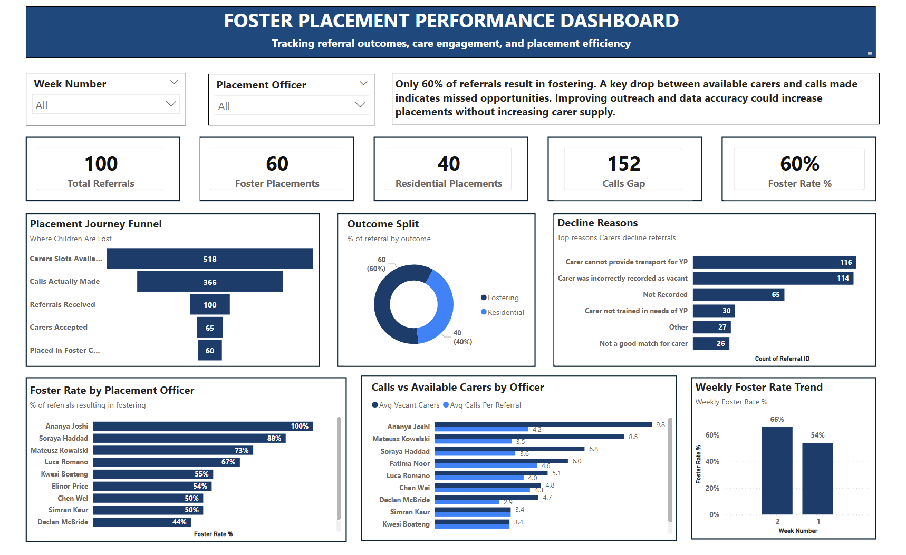

# Foster Placement Performance Dashboard

**Power BI | DAX | Children's Social Care**

---

## The brief

The Head of Service for a fostering organisation wanted to increase the number of children 
placed in foster care when a referral comes in.

The working assumption from the business was that the problem was structural: a national 
shortage of foster carers, not enough available placements, and carers declining too often.

The data told a different story.

---

---

## What I found

### The shortage is not the issue. The process is.

518 carer slots were available across the two-week period. Officers made 366 calls. 
100 referrals came in. 60 children were placed in foster care.

The largest single drop in the entire journey happens before a carer is even contacted, 
not at the point of decline.

---

### 73.5% of all recorded declines come from two causes that can be fixed without recruiting a single new carer

| Decline Reason | Count |
|---|---|
| Carer could not provide transport for the young person | 116 |
| Carer incorrectly recorded as vacant on the system | 114 |
| **Total** | **230 of 313** |

These are a data quality problem and a logistics problem. Both are operational fixes:

- Cleaning the vacancy data would eliminate a significant share of wasted calls immediately
- Filtering by transport availability before calling would reduce transport drop-offs before they become declines

---

### Officer performance splits into two distinct problems, not one

**Group 1: not using full carer capacity:**
Some officers leave meaningful call capacity unused across referrals. For these officers, 
the lever is outreach volume. More calls from the same carer pool would likely produce 
more placements.

**Group 2: already calling every available carer:**
Others are exhausting their full carer list and still placing at around 50%. More calls 
will not help them. Their carer pool needs reviewing for quality and match suitability.

Treating both groups the same way would be the wrong response. The data makes clear 
they need different support.

---

### Foster rate dropped from 66% in week 1 to 54% in week 2

Only two weeks of data, so this is a signal not a conclusion. Worth tracking as volume grows.

---

## The answer to the original question

The Head of Service asked how to place more children in foster care. The business was 
looking at carer recruitment as the answer.

The analysis shows the more immediate lever is operational:

1. Fix the vacancy data
2. Address transport earlier in the referral process
3. Ensure officers are working through the full carer capacity available to them

These changes could meaningfully increase foster placements before any new carers are recruited.

---

## Dashboard

Single-page Power BI report with week and officer slicers.

| Visual | Purpose |
|---|---|
| KPI cards | Total referrals, foster placements, residential placements, calls gap, foster rate |
| Placement journey funnel | Where children exit the process |
| Outcome split | Fostering vs residential |
| Decline reason breakdown | Top barriers to placement |
| Foster rate by officer | Consistency across the team |
| Calls vs available carers | Outreach capacity and usage by officer |
| Weekly trend | Foster rate movement over time |

Built from a wireframe sketch and a raw dataset. 

---

## Built with

- **Power BI Desktop**
- **DAX**: foster rate %, calls gap, officer-level averages, funnel steps

---

## Files

- `Initial_Data.xlsx`: raw referral and call log data (Referrals, Call Log, Call Log Full, POs)
- `Foster_Placement_Dashboard.pbix`:  Power BI file (open in Power BI Desktop)
- `Dashboard_Preview.pdf`: static export for viewing without Power BI
